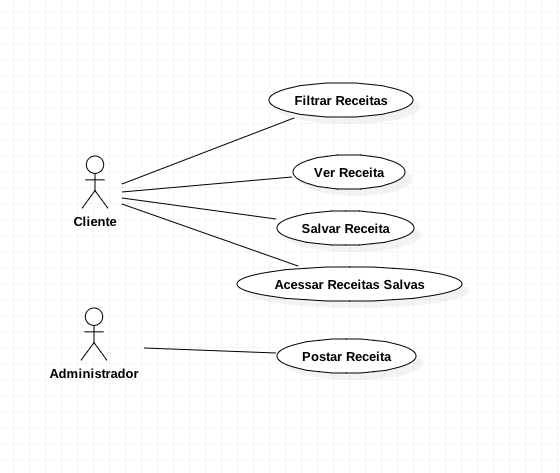

# Documento de Visão do Projeto "Think Tasty"
Este documento apresenta uma solução de software para o projeto "Think Tasty", apresentando os problemas a serem solucionados, as necessidades dos principais envolvidos, o alcance do projeto e as funcionalidades esperadas do sistema.

## Objetivos

*	Disponibilizar às pessoas com diabetes e/ou intolerância a lactose e/ou intolerância a glúten diversas opções de receitas que respeitem estas restrições.

## Problema

* Descrição do problema: muitas receitas disponibilizadas na internet e em outros meios que são feitas de maneira alternativa para pessoas com intolerância a lactose e/ou diabetes e/ou intolerância a gluten não são tão saborosas quanto as “originais”; e as pessoas quando não tem estas doenças desde que nasceram, acabam tendo dificuldades ao readequar a alimentação. Portanto, o objetivo do software é disponibilizar receitas que sejam saborosas e respeite as restrições que as pessoas com estas deficiências possuem.
* Quem é afetado pelo problema: Pessoas que possuem diabetes e/ou intolerância a lactose e/ou intolerância a glúten.
* Benefícios de uma boa solução: Apoiar as pessoas afetadas pelos problemas mencionados a sanar as vontades de comidas ou doces que não poderiam comer devido a intolerância a algum dos componentes destes alimentos.

## Definições, abreviações e outros termos do domínio do problema
* Glicose.
* Lactose.
* Hiperglicemia.
* Pâncreas.
* Doença celíaca.
* Sensibilidade não celíaca.

 
## Interessados
* Pessoas com Diabetes.
* Pessoas com Intolerância a Lactose.
* Pessoas com Intolerância a Glúten.
* Pessoas que tenham duas ou três das deficiências mensuradas acima.

## Usuários
* Administrador
* Cliente

* Funcionários
* Gestão
* Administrador

## Funcionalidades do produto

* Filtrar as receitas
* Ver a reecita
* Salvar a receita
* Acessar receitas salvas
* Postar a receita

## Restrições do projeto

* O Software não terá receitas que não atendam pelo menos uma das três deficiências impostas (intolerância a glúten, intolerância a lactose ou diabetes).

## Casos de Uso

