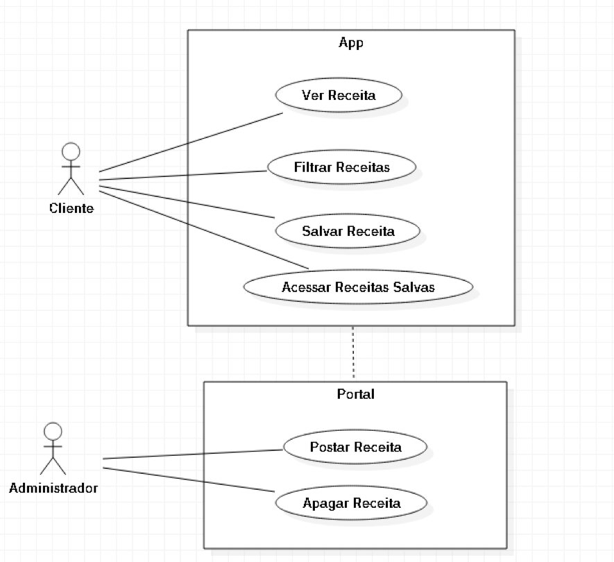

# Casos de uso

## 1. Diagrama de casos de uso

## 2. Especificação dos casos de uso

### 2.1 Caso de uso:  Ver receitas
| Campo          | Informação        |
|---|---|
| Identificador: |     UC01|
| Nome:          |     Ver Receitas|
| Atores:        |  Cliente|
| Sumário:       | O cliente pode aplicar o Caso de Uso ‘UC02’ ou não e clicar na receita para poder ver o seu conteúdo.|

| Fluxo Principal |
| 1)O sistema direciona o usuário a aba ‘Receitas’, disponível como primeira opção da tab bar , sendo que há a possibilidade de  filtrar de acordo com o caso de uso ‘UC02’|
| 2)O usuário clica na receita desejada|
| 3)O sistema retorna a página da receita, que poderá ser salva|

| Fluxo Alternativo |
|---|
| 1)O sistema direciona o usuário a aba ‘Receitas’,  sendo que há a possibilidade de  filtrar|
| 2)O usuário filtra de acordo com os critérios desejados|
| 3)O sistema retorna as receitas que atendem o filtro definido|
| 4)O usuário clica na receita desejada|
| 5)O sistema retorna a página da receita, que poderá ser salva|

### 2.2. Caso de uso:  Filtrar Receitas
| Campo          | Informação        |
|---|---|
| Identificador: |     UC02|
| Nome:          |     Filtrar Receitas|
| Atores:        |  Cliente|
| Sumário:       | Dentre todas as receitas da base, o usuário filtra as receitas selecionando as doenças que possui e se deseja receitas doces ou salgadas||

| Fluxo Principal |
|---|
|1) O sistema direciona o usuário a aba ‘Receitas’, disponível como primeira opção da tab bar, sendo que há a possibilidade de  filtrar de acordo com o caso de uso ‘UC02’|
|2) O usuário seleciona os filtros que deseja e clica em ‘Buscar’|
|3) O sistema retorna as receitas que atendem o filtro especificado|

### 2.3 Caso de uso : Salvar receita
| Campo          | Informação        |
|---|---|
| Identificador: |     UC03|
| Nome:          |     Salvar Receitas|
| Atores:        |  Cliente|
| Sumário:       | Na tela da receita, há um botão denominado ‘Salvar Receita’ para que a receita fique armazenada no dispositivo||

| Fluxo Principal |
|---|
|1) O sistema direciona o usuário a aba ‘Receitas’, disponível como primeira opção da tab bar,  sendo que há a possibilidade de  filtrar de acordo com o caso de uso ‘UC02’|
|2) O usuário irá clicar na receita|
|3) O sistema retorna a página da receita com o botão ‘Salvar’|

### 2.4 Caso de uso : Acessar receitas salvas
| Campo          | Informação        |
|---|---|
| Identificador: |     UC04|
| Nome:          |     Acessar receitas salvas|
| Atores:        |  Cliente|
| Sumário:       | O usuário acessa as receitas que salvou para dinamizar o acesso e poder acessá-las off-line|

| Fluxo Principal |
|---|
|1) O sistema direciona o usuário a aba ‘Receitas’, disponível como primeira opção da tab bar,  sendo que há a possibilidade de  filtrar|
|2) O usuário clica em ‘Favoritas’, disponível como segunda  opção da tab bar|
|3) O sistema retorna as receitas salvas, sendo que há a possibilidade de filtrar de acordo com o caso de uso ‘UC02’|
|4) O usuário pode ver a página da receita, de acordo com o caso de uso ‘UC02’|

### 2.5 Caso de Uso: Postar Receita
| Campo          | Informação        |
|---|---|
| Identificador: |     UC05|
| Nome:          |  Postar Receita|
| Atores:        |  Administrador|
| Sumário:       | O usuário acessa o portal online com as credenciais de usuário definidas para postar novas receitas|

| Fluxo Principal |
|---|
| 1)O usuário acessa o portal online e faz login|
| 2)O sistema retorna uma página de menu com as opções|
| 3)O usuário acessa a opção ‘Postar Receita’|
| 4)O Sistema devolve um formulário|
| 5)O usuário preenche o formulário com a receita e as restrições que a receita atende (por checkbox) e salva|

### 2.6 Caso de Uso: Apagar Receita
| Campo          | Informação        |
|---|---|
| Identificador: |     UC05|
| Nome:          |  Apagar Receita|
| Atores:        |  Administrador|
| Sumário:       | O usuário acessa o portal online com as credenciais de usuário definidas para apagar receitas que não são tão visualizadas ou para postar novamente uma receita que foi postada com algum erro|

| Fluxo Principal |
|---|
| 1)O usuário acessa o portal online e faz login|
| 2)O sistema retorna uma página de menu com as opções|
| 3)O usuário acessa a opção ‘Apagar Receita’|
| 4)O Sistema mostra as receitas publicadas|
| 5)O usuário seleciona a(s) receita(s) que deseja apagar e salva|

| Fluxo Alternativo |
|---|
| 1)O usuário acessa o portal online e faz login|
| 2)O sistema retorna uma página de menu com as opções|
| 3)O usuário acessa a opção ‘Apagar Receita’|
| 4)O Sistema mostra as receitas publicadas|
| 5)O usuário não seleciona nenhuma receita|
| 6)O sistema exibe um erro alegando que nenhuma receita foi selecionada|

